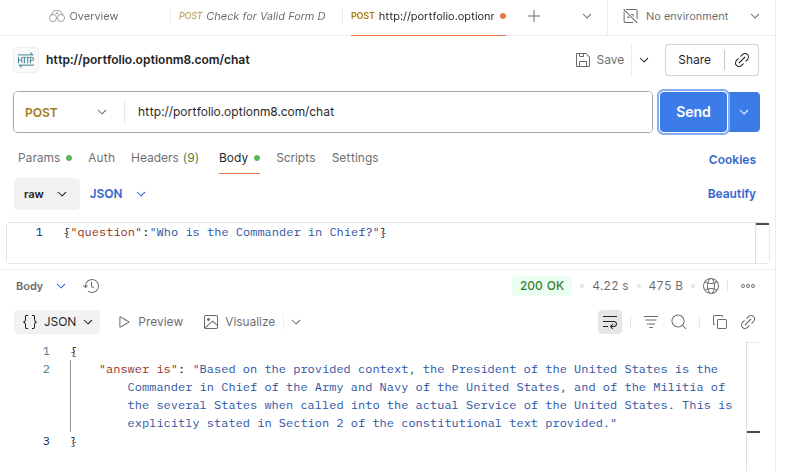

# Masayoshi Nakamura - Portfolio (November 2025)

## 1\. Introduction

I design and build **scalable, automated, cloud-native applications**.

This repository is my portfolio, centered on a GenAI RAG API. This project showcases the full application lifecycle: a modern GenAI stack (Bedrock, LangChain), infrastructure provisioned as code (AWS CDK), and a complete, automated CI/CD pipeline (GitHub Actions).

  * **Application Repo:** `github.com/masayang/langchain-rag-project` (Private)
  * **Infrastructure Repo:** `github.com/masayang/aws-cdk-infra` (Private)

## 2\. Core Competencies

  * **Backend:** Python (FastAPI, LangChain)
  * **Cloud & IaC:** AWS (ECS, Fargate, Bedrock, ECR, ALB), AWS CDK (Python)
  * **CI/CD:** GitHub Actions (Unit Testing, Docker Builds, ECR Push, Deployment to ECS)
  * **Database:** Chroma Cloud (Vector DB)
  * **Other:** Docker, `uv` (Python Package Manager), Git

-----

## 3\. Project (1): GenAI RAG Chatbot API

This is a RAG (Retrieval-Augmented Generation) API backend that answers questions about the U.S. Constitution.

### Architecture (Modern Serverless Stack)

This project uses a modern, **GPU-less architecture** that eliminates heavy `torch` dependencies and the need for local GPU management. The design is lightweight and relies entirely on scalable, serverless cloud APIs.

  * **LLM:** Amazon Bedrock (Anthropic Claude 3.5 Sonnet)
  * **Embedding:** Amazon Bedrock (Amazon Titan Embeddings V2)
  * **Vector DB:** Chroma Cloud (A fully-managed, multi-tenant vector database)
  * **Orchestration:** LangChain (LCEL for chaining retrievers and prompts)
  * **API:** FastAPI (Containerized with Docker)

### CI/CD (Quality Assurance)

  * On every `git push`, a GitHub Actions workflow automatically runs `pytest` **Unit Tests**.
  * Builds that pass testing are containerized and automatically pushed as a new image to **Amazon ECR**.
  * (Future Work: Adding Integration and E2E tests.)

-----

## 4\. Project (2): Application Infrastructure Platform

This is the AWS infrastructure, built from scratch, to host the RAG Chatbot API.

### Infrastructure as Code (IaC)

The entire infrastructure is provisioned using the **AWS CDK (Python)**, ensuring a reproducible, version-controlled, and automated environment.

  * **Infrastructure:** VPC, Subnets, Security Groups
  * **Execution Environment:** **Fargate ECS** for container orchestration + **API Gateway** for the HTTP endpoint.
  * **Region:** Tokyo (ap-northeast-1)

### Key Features & Future Work

  * **Cost Optimization:** The dev/demo environment **intentionally omits the NAT Gateway**, saving \~$30/month per VPC.
  * **Automated Safeguards:** The CI/CD pipeline blocks any infrastructure deployment that fails its `pytest` CDK unit tests.
  * **Future Work:** Planning to implement distinct Staging/Production environments and a Blue/Green deployment strategy.

-----

## 5\. The Core: Automated Deployment Pipeline

The heart of this portfolio is the automated deployment pipeline that **connects the App and Infra repositories**.


1.  **[App Repo]** A developer runs `git push`.
2.  **[App Repo / GitHub Actions]**
    1.  Run Unit Tests.
    2.  Build the Docker image.
    3.  Push the new image to Amazon ECR.
3.  **[ECR -\> ECS Integration]**
    1.  The push to ECR automatically **triggers an ECS service update**.
    2.  The **ECS service** detects the new image and performs a **rolling update**, replacing the old tasks with the new version without downtime.

This setup enables a true **GitOps workflow**: developers simply push code, and the automated pipeline handles testing, building, and deploying to the cluster without manual intervention.

-----

## 6\. Example Usage

### API Request (curl)

```bash
# POST a question to the API Gateway endpoint
curl -X POST "http://portfolio.optionm8.com/chat" \
-H "Content-Type: application/json" \
-d '{
    "question": "What is judicial power? Which article and section is it in?"
}'
```

### API Response (JSON)

```json
{
  "answer": "According to the context, judicial power is vested in one Supreme Court and in such inferior Courts as the Congress may from time to time ordain and establish. This is detailed in Article III, Section 1."
}
```

