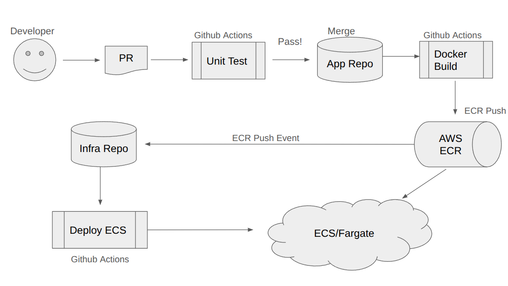
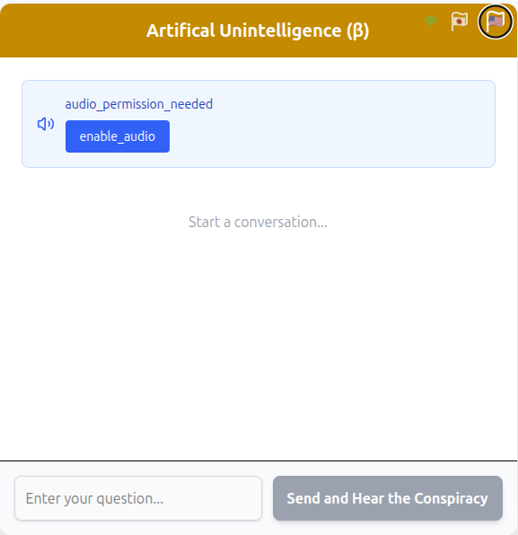

# Masayoshi Nakamura - Portfolio (December 2025)

## 1\. Introduction

Developed a full‑stack GenAI chatbot platform featuring **RAG + TTS with real‑time WebSocket streaming**.

Backend (FastAPI + kokoro_onnx) runs on AWS ECS Fargate, while the React frontend is deployed on S3 + CloudFront. 

Both pipelines are fully automated through GitHub Actions (test, build, ECR/ECS or S3/CDN deploy) enabling seamless GitOps‑style delivery.

  * **Backend Repo:** `https://github.com/masayang/tts-service` (Private)
  * **Frontend Repo:** `https://github.com/masayang/tts_frontend` (Private)
  * **Infrastructure Repo:** `https://github.com/masayang/aws_cdk_tokyo` (Private)

## 2\. Core Competencies

  * **Backend:** Python (FastAPI, LangChain)
  * **Cloud & IaC:** AWS (ECS, Fargate, Bedrock, ECR, ALB), AWS CDK (Python)
  * **CI/CD:** GitHub Actions (Unit Testing, Docker Builds, ECR Push, Deployment to ECS)
  * **Database:** Chroma Cloud (Vector DB)
  * **Other:** Docker, `uv` (Python Package Manager), Git

-----

## 3\. Project (1): Real-time Voice Chatbot API (RAG + TTS)

This project evolves the original RAG chatbot backend into a **real-time, voice-enabled GenAI chatbot** that streams both text and generated speech to the user.

### Architecture Overview

A fully serverless, cloud-native implementation that combines **retrieval-augmented reasoning** with **CPU-optimized text-to-speech synthesis**.

- **Language Model**: Amazon Bedrock – *Claude 3.5 Sonnet*
- **Embeddings**: Amazon Bedrock – *Amazon Titan Embeddings V2*
- **Vector Store**: *Chroma Cloud* (managed, multi-tenant)
- **Framework / Orchestration**: *FastAPI + LangChain (LCEL)*
- **TTS Backend**: *kokoro_onnx* (CPU-only, no GPU dependencies)
- **Audio Format**: WAV (streamed via WebSocket in real time)
- **Frontend**: *React SPA*, receives and plays streaming audio
- **Hosting**: AWS ECS (Fargate) in Tokyo region (ap-northeast-1)

### Real-time Streaming
Claude’s generated text is incrementally converted to speech and streamed back over WebSocket with minimal latency.

Even on a constrained **1 vCPU / 1 GB memory** environment, the ONNX-based TTS pipeline maintains responsive, low-latency interaction.

### CI/CD & Deployment

- On every git push, **GitHub Actions** runs unit tests, builds a container, and pushes it to **Amazon ECR**.
- **ECS** automatically detects the new image and performs a rolling update with zero downtime.
This setup enables a complete **GitOps-style workflow** for continuous delivery of both the RAG and TTS services.

### Future Enhancements
- Audio result caching and reuse (e.g., S3-based audio store).
- Real-time speech input (voice-to-text) support.
- Integration testing for WebSocket streaming in CI/CD.

-----

## 4\. Project (2): Application Infrastructure Platform

This is the AWS infrastructure, built from scratch, to host the RAG Chatbot API.

### Infrastructure as Code (IaC)

The entire infrastructure is provisioned using the **AWS CDK (Python)**, ensuring a reproducible, version-controlled, and automated environment.

  * **Infrastructure:** VPC, Subnets, Security Groups
  * **Execution Environment:** **Fargate ECS** for container orchestration + **API Gateway** for the HTTP endpoint.
  * **Region:** Tokyo (ap-northeast-1)

### Key Features & Future Work

  * **Cost Optimization:** The dev/demo environment **intentionally omits the NAT Gateway**, saving \~$30/month per VPC.
  * **Automated Safeguards:** The CI/CD pipeline blocks any infrastructure deployment that fails its `pytest` CDK unit tests.
  * **Future Work:** Planning to implement distinct Staging/Production environments and a Blue/Green deployment strategy.

-----

## 5\. The Core: Automated Deployment Pipeline

The heart of this portfolio is the automated deployment pipeline that **connects the App and Infra repositories**.

1.  **[App Repo]** A developer runs `git push`.
2.  **[App Repo / GitHub Actions]**
    1.  Run Unit Tests.
    2.  Build the Docker image.
    3.  Push the new image to Amazon ECR.
3.  **[ECR -\> ECS Integration]**
    1.  The push to ECR automatically **triggers an ECS service update**.
    2.  The **ECS service** detects the new image and performs a **rolling update**, replacing the old tasks with the new version without downtime.

This setup enables a true **GitOps workflow**: developers simply push code, and the automated pipeline handles testing, building, and deploying to the cluster without manual intervention.

-----

## 6\. The actual app

https://chat.optionm8.com/

1. Click or tap "enable_audio" button first.
2. Enter your query, then tap "Send"
3. The audio will start automatically.
4. Please don't take the output seriously.

