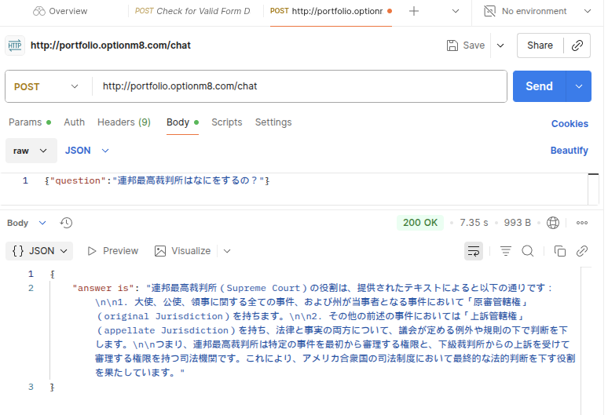

# Masayoshi Nakamura ポートフォリオ (2025年11月)

## 1\. はじめに

**スケーラブルで自動化されたクラウドネイティブ・アプリケーション**の設計・構築に取り組んでいます。

このリポジトリは、私が作成したプロジェクトの概要をまとめたポートフォリオです。中心となるプロジェクトは、**モダンなGenAIスタック（Bedrock, LangChain）で構築したRAG API**と、それを**AWS CDKによるIaC**でホストし、**GitHub ActionsでCI/CDを組んだ**プラットフォームです。

  * **App Repo:** `github.com/masayang/langchain-rag-project` (Private)
  * **Infra Repo:** `github.com/masayang/aws-cdk-infra` (Private)

## 2\. スキルハイライト

  * **バックエンド:** Python (FastAPI, LangChain)
  * **クラウド & IaC:** AWS (ECS, Fargate, Bedrock, ECR, ALB), AWS CDK (Python)
  * **CI/CD:** GitHub Actions (Unit Test, Docker Build, ECR Push, ECS Deploy)
  * **データベース:** Chroma Cloud (Vector DB)
  * **その他:** Docker, `uv` (Python Package Manager), Git

-----

## 3\. プロジェクト (1): 生成AI RAGチャットボット API

米国憲法に関する質問に回答する、RAG (Retrieval-Augmented Generation) APIバックエンドです。

### アーキテクチャ (モダンなサーバーレス構成)

ローカルでのGPU管理や`torch`依存を完全に排除し、スケーラブルなクラウドAPIで完結する設計を採用しました。

  * **LLM:** Amazon Bedrock (Anthropic Claude 3.5 Sonnet)
  * **Embedding:** Amazon Bedrock (Amazon Titan Embeddings V2)
  * **Vector DB:** Chroma Cloud (フルマネージドのマルチテナントVector DB)
  * **Orchestration:** LangChain (LCELによるRetrieverとPromptのチェイン)
  * **API:** FastAPI (Dockerコンテナ化)

### CI/CD (GitHub Actionsによる品質担保)

  * `git push` をトリガーに、`pytest`による**Unit Test**が自動実行されます。
  * テストをパスしたフィーチャーブランチ（または`main`）のみ、Dockerイメージがビルドされ、**Amazon ECR**に自動でプッシュされます。
  * （計画中: Integration Test, E2Eテストの追加）

-----

## 4\. プロジェクト (2): アプリケーション・プラットフォーム

上記「RAGチャットボットAPI」をホストするための、AWSインフラストラクチャです。

### 構成 (AWS CDKによるInfrastructure as Code)

**AWS CDK (Python)** を使用し、インフラ構成をコード化することで、再現性の高い環境構築を実現しました。

  * **インフラ:** VPC, Subnet, Security Group
  * **実行環境:** Fargate ECS (コンテナ実行) + ALB (APIエンドポイント)
  * **リージョン:** Tokyo Region

### 工夫点と将来の展望

  * **コスト意識:** 開発デモ環境では、コストのかかる**NAT Gatewayを意図的に省略**し、月額約$30のコストを節約。
  * **CI/CD:** CDKのUnit Test (`pytest`) が通らない限りデプロイできないCI/CDパイプラインを構築。
  * **将来の展望:** Staging/Production環境の構築、Blue/Greenデプロイメントの実装を計画中。

-----

## 5\. 連携: 2つのリポジトリによる自動デプロイ

このポートフォリオの核心は、2つのPrivateリポジトリが連携して実現する**自動デプロイパイプライン**です。


1.  **[App Repo]** 開発者が `git push`
2.  **[App Repo / GitHub Actions]**
    1.  Unit Test実行
    2.  Dockerイメージをビルド
    3.  Amazon ECRに新バージョンのイメージをプッシュ
3.  **[ECR -\> ECS 連携]**
    1.  ECRへのプッシュをトリガーし、**[Infra Repo]** 側のインフラ（ECS）に通知
    2.  **ECSサービス**が新イメージを自動でプルし、タスクを入れ替える（ローリングアップデート）

これにより、開発者は**コードを書くだけ**で、インフラを意識することなく本番環境（ECS）へのデプロイが完了します。

-----

## 6\. 実行例

### APIへのリクエスト (curl)

```bash
# ALBのエンドポイントに対して質問をPOST
curl -X POST "http://portfolio.optionm8.com/chat" \
-H "Content-Type: application/json" \
-d '{
    "question": "連邦最高裁判所はなにをするの？"
}'
```

### APIからのレスポンス (JSON)

```json
{
  "answer": "連邦最高裁判所（Supreme Court）の役割は、提供されたテキストによると以下の通りです：\n\n1. 大使、公使、領事に関する全ての事件、および州が当事者となる事件において「原審管轄権」（original Jurisdiction）を持ちます。\n\n2. その他の前述の事件においては「上訴管轄権」（appellate Jurisdiction）を持ち、法律と事実の両方について、議会が定める例外や規則の下で判断を下します。\n\nつまり、連邦最高裁判所は特定の事件を最初から審理する権限と、下級裁判所からの上訴を受けて審理する権限を持つ司法機関です。これにより、アメリカ合衆国の司法制度において最終的な法的判断を下す役割を果たしています。"
}
```

